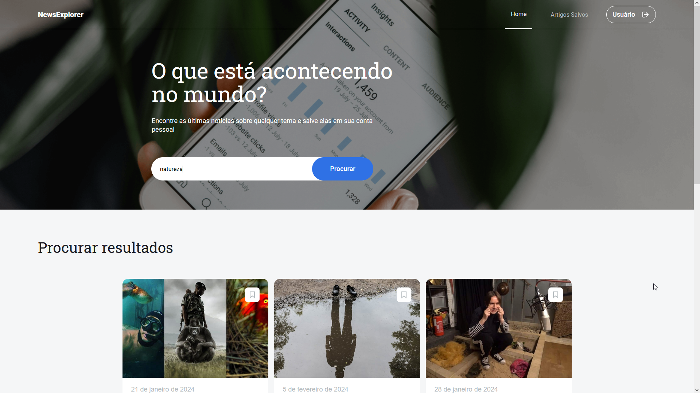
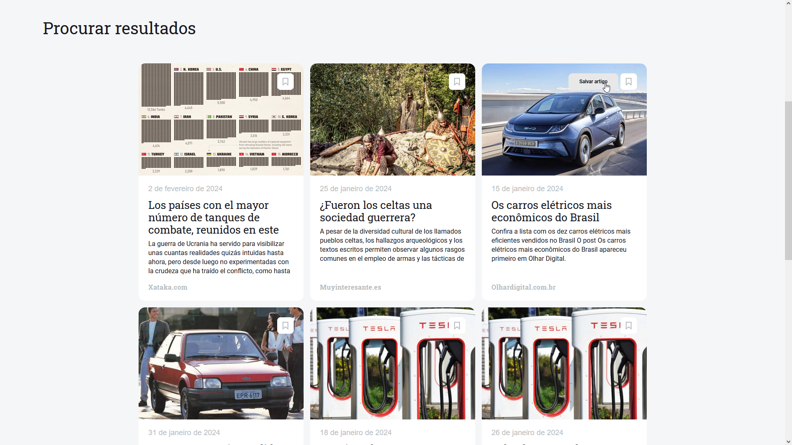

# News Explorer

Um website onde os usuários podem pesquisar por diversas notícias e salvar suas favoritas.

Este projeto foi feito usando o framework React.js para criar um site responsivo e também para proteger certas rotas de usuários não logados.

O login e registro ainda não estão funcionais, então você pode logar-se usando qualquer e-mail e senha, sem ser necessário um registro.

Você pode visitar o site no seguinte [link](https://newsexplorer.jumpingcrab.com/).
