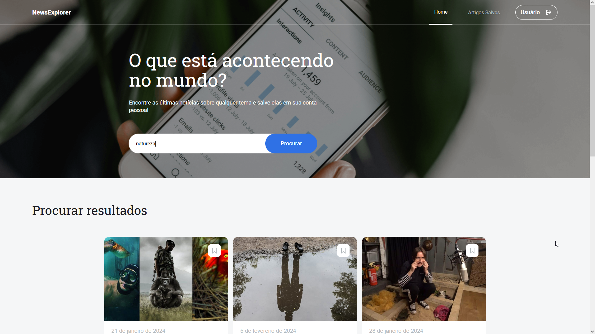
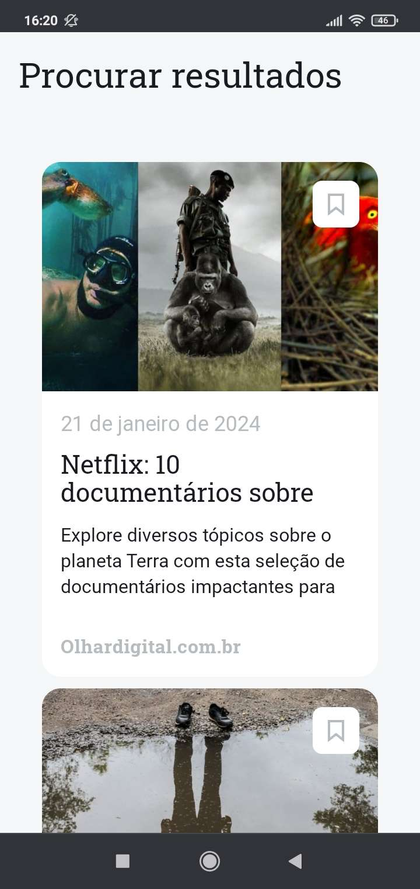
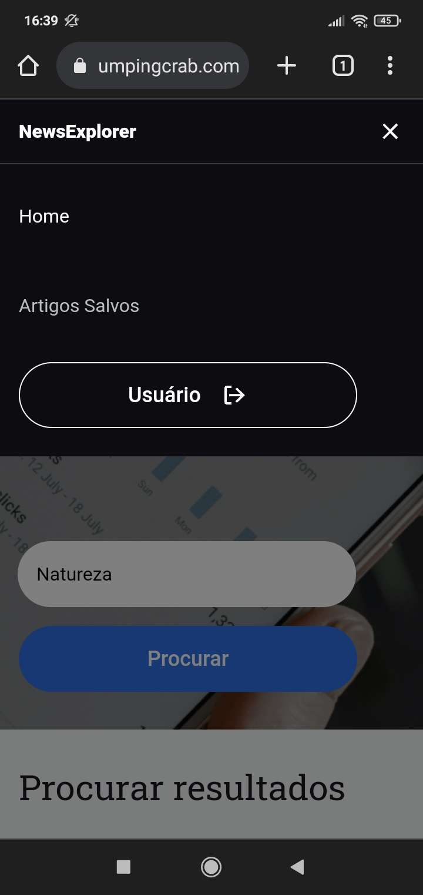

# News Explorer

[](https://github.com/anynoise00/news-explorer-frontend/blob/main/LICENSE)  

## About
NewsExplorer is a website where users can search for news of any topic and save the ones they like to read later.  

This is the front-end of the project was made as the final project from TripleTen's online web development bootcamp.
In this project I applied everything that I learned about React and front-end development, such as routing, authentication and server integration.

There's also the back-end repository for this project, check it [here](https://github.com/anynoise00/news-explorer-backend).

### Click [here](https://newsexplorer.jumpingcrab.com/) to visit the website.

You can use the account below to check the website without needing to register:
```
Login: usuario@mail.com
Password: senhasenha
```

## Mobile layout
  

## Technologies
The following tools where used for building this project:
- [React](https://reactjs.org/)
- [React Router](https://reactrouter.com/en/main)
- [Node.js](https://nodejs.org/en/)
- HTML, CSS & JavaScript
- BEM methodology

## Credits
This projects uses [TripleTen](https://tripleten.com/)'s figma template  
[](https://www.figma.com/file/pjv6Im0hLJ0Rny2zSYZXQ3/Seu-projeto-final-pt?type=design&node-id=0-1&mode=design&t=PEhFyr7EpFBRQt42-0)
